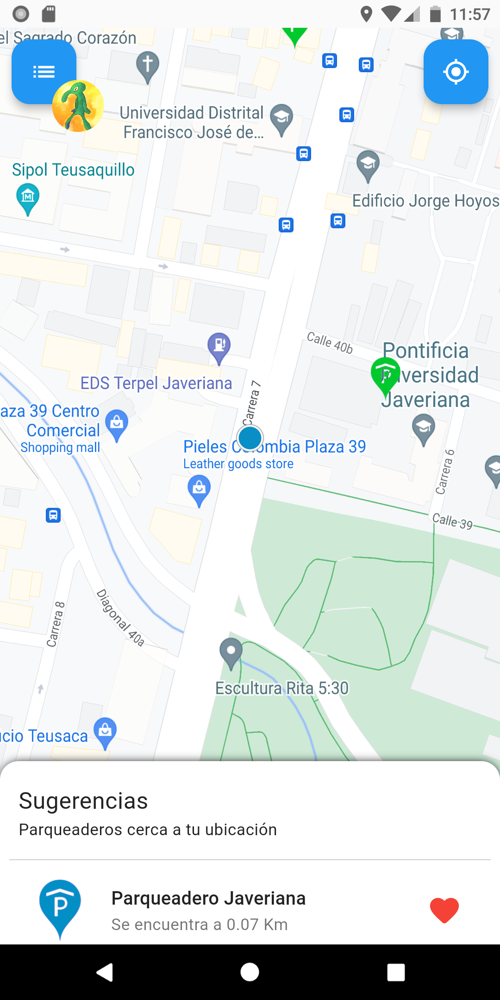
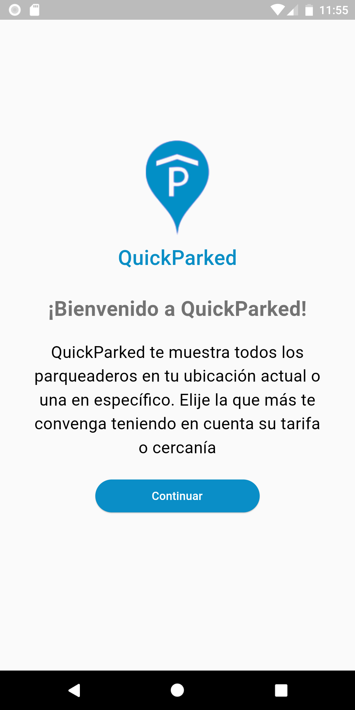
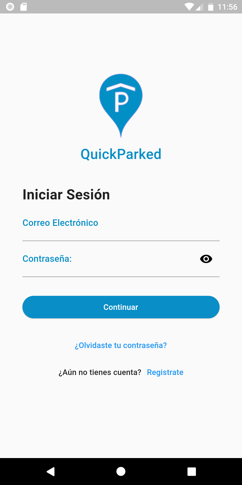
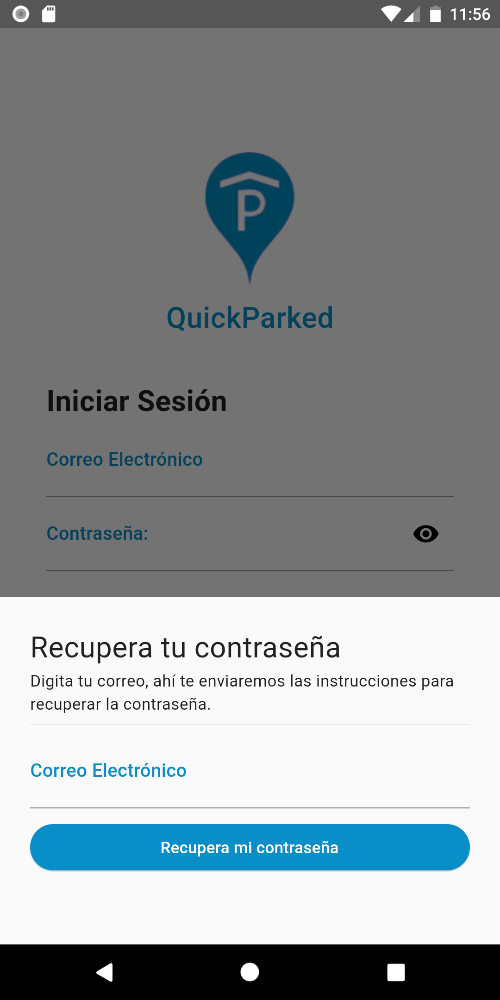
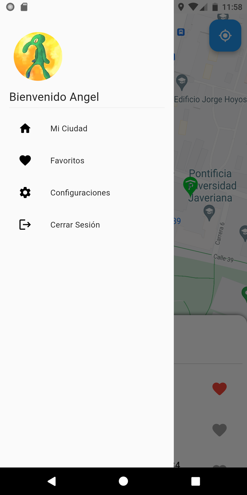
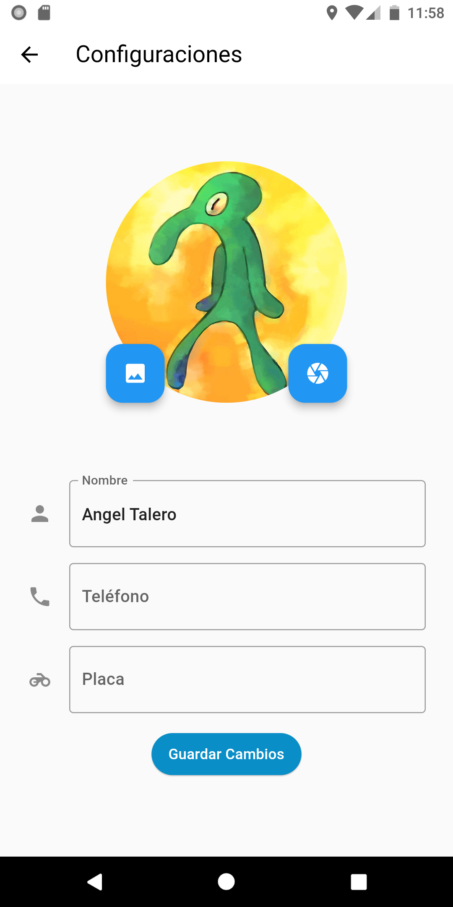
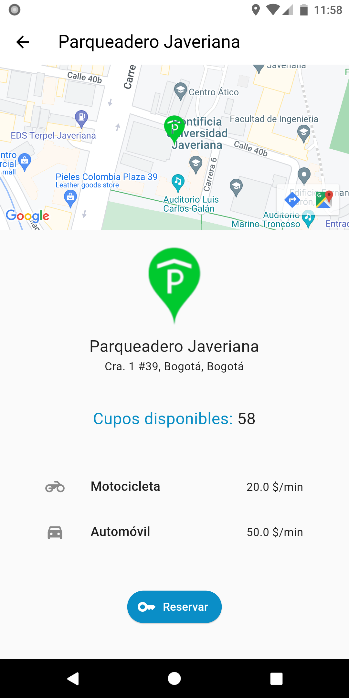

# QuickParked
QuickParked es un aplicativo que permite encontrar parqueaderos cercanos a tu ubicación, reservarlos, planear tu viaje y agregar favoritos.

| Capturas                       |                                  |
| ------------------------------ | -------------------------------- |
|  |  |

## Pantallas
El Aplicativo tiene implementada una función de Autenticación (Login, Signup y Password Reset), una vez iniciada sesión se muestra el mapa y las sugerencias, el botón con el ícono del usuario muestra un menú para cerrar sesión, ver los parqueaderos de la ciudad, ver los favoritos y entrar a configuraciones, en configuraciones es posible cambiar la información básica del usuario y la foto de perfil. Hacer click sobre un parqueadero muestra su información básica, aquellos parqueaderos sin cupo muestran un botón rojo de 'Avísame' cuando este botón es presionado tan pronto el parqueadero tenga cupos disponibles llegará una notificación de disponibilidad.

|                                                  |                                                    |                                                            |
| ------------------------------------------------ | -------------------------------------------------- | ---------------------------------------------------------- |
|                |                |  |
|  |  |           |